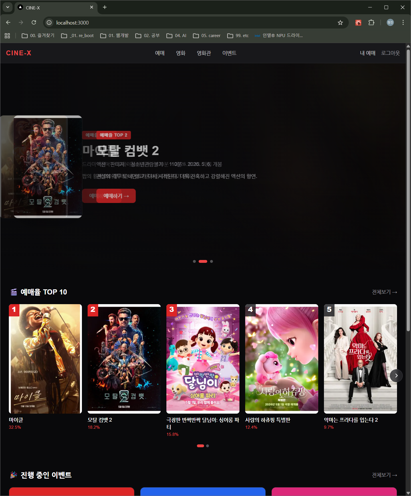
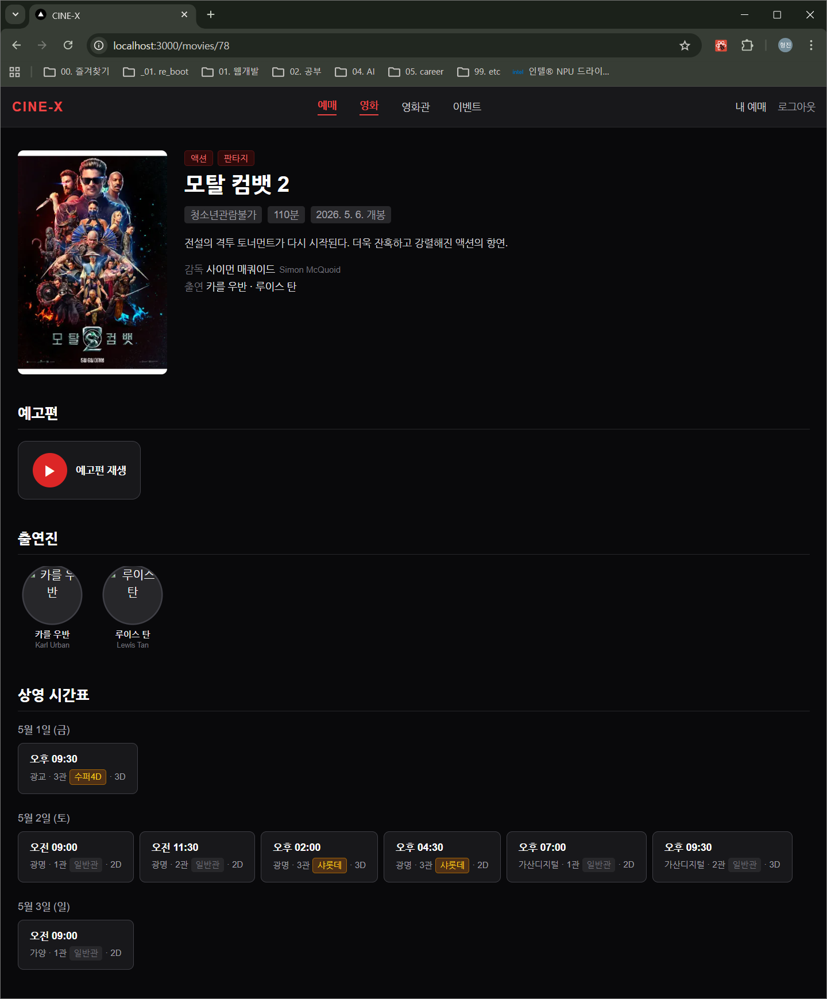
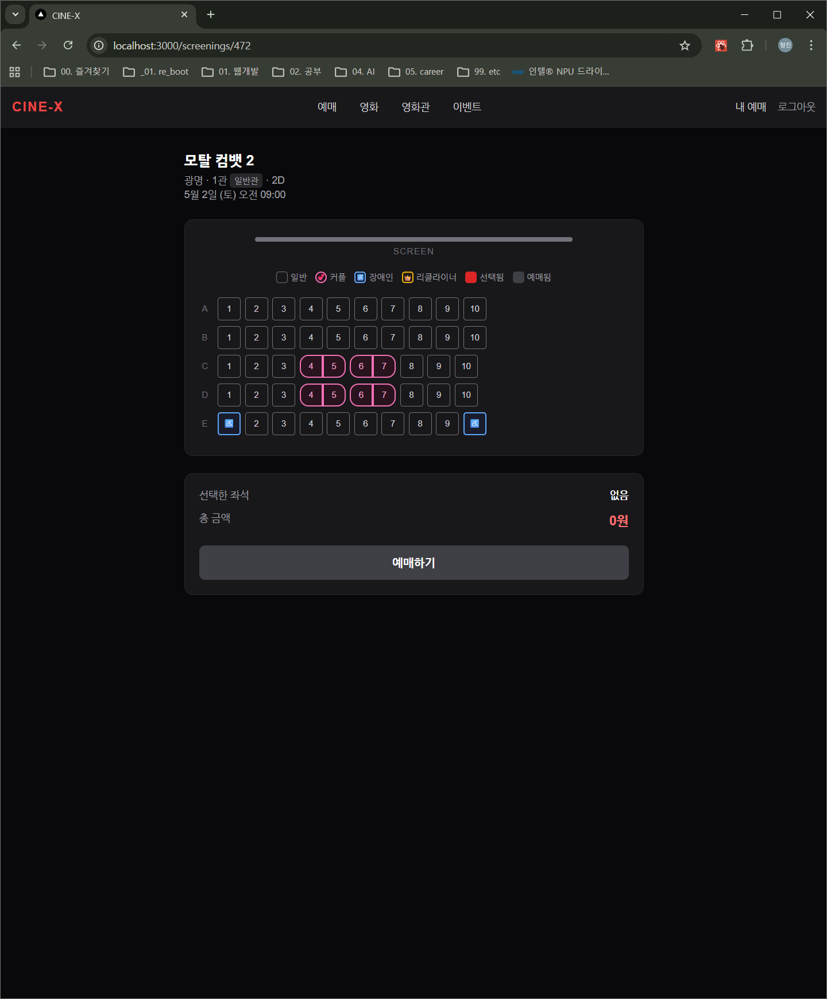
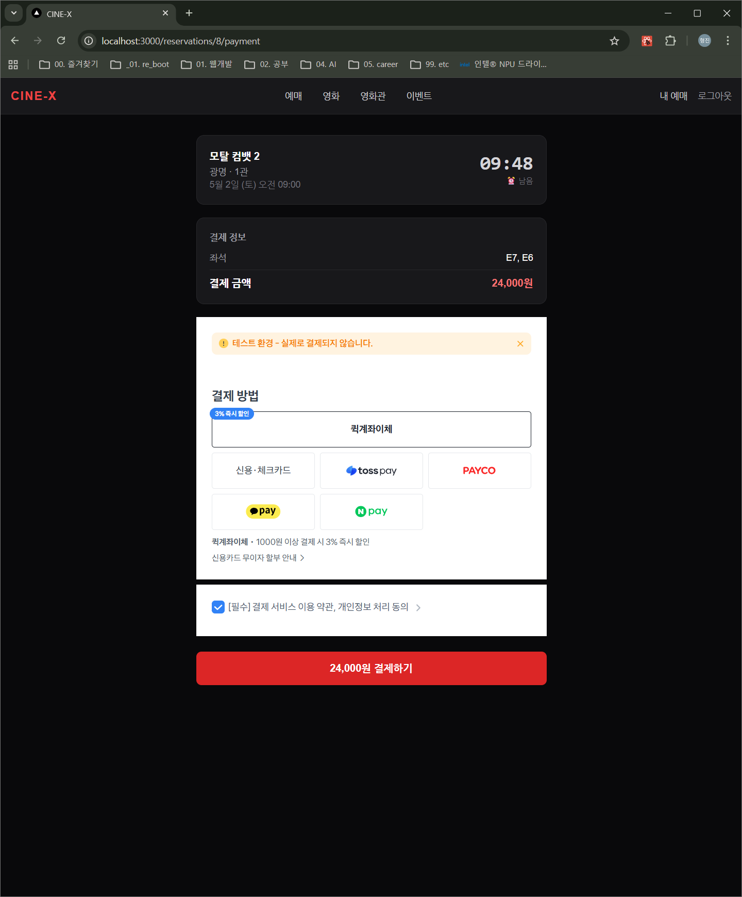
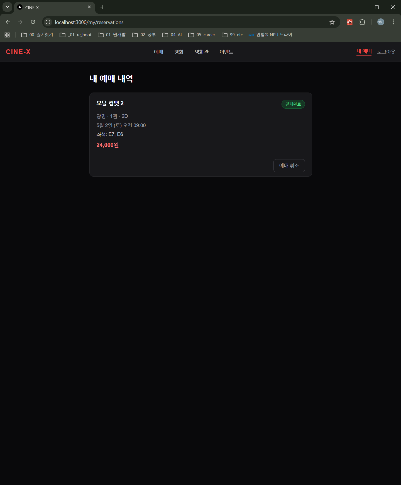

# CINE-X 🎬

[](https://github.com/hjlim-log/cine-x/actions/workflows/ci.yml)
[](LICENSE)

> NestJS + Next.js로 만든 영화관 예매 풀스택 데모 사이트

## 📸 Demo

> 스크린샷은 `docs/screenshots/` 폴더를 참조하세요.

| 홈 화면 | 영화 상세 + 트레일러 |
|---|---|
|  |  |

| 좌석 선택 | 토스 결제 위젯 | 내 예매 내역 |
|---|---|---|
|  |  |  |

## ✨ 주요 기능

### 관리자 페이지 (`/admin`)

> **관리자 계정으로 로그인해야 접근 가능** — JWT의 `role: ADMIN` 검증, 일반 사용자 접근 시 차단

#### 매출 대시보드 (`/admin`)

실시간 통계 9가지 차트를 한 화면에 제공합니다.

| 구성 요소 | 내용 |
|---|---|
| **KPI 카드 4개** | 총 매출 / 총 예매수 / 총 회원수 / 평균 객단가 |
| **매출 추이** | 일별 매출 Line 차트 (날짜-fns 한국어 툴팁) |
| **멤버십 등급 분포** | 회원 등급별 인원 Donut 차트 |
| **영화별 매출 TOP10** | 수평 Bar 차트 + ₩만 단위 레이블 |
| **영화관별 매출** | 영화관 비중 Pie 차트 |
| **좌석 점유율** | 영화관별 % Bar (점유율에 따라 녹/황/적 색상) |
| **쿠폰 사용률** | USED·AVAILABLE·EXPIRED Donut + 중앙 "XX%" 텍스트 |
| **제휴 할인 현황** | 파트너사별 사용 횟수 수평 Bar |
| **시간대별 예매 히트맵** | 요일 × 24시간 Custom Grid (붉은 투명도로 밀도 시각화) |
| **평균 객단가 추이** | 일별 평균 결제금액 Line + 기간 평균 기준선 |

- **기간 토글** (7일 / 30일 / 90일) — 변경 시 9개 API `Promise.all` 병렬 재호출
- **스켈레톤 로딩** — 데이터 fetch 중 펄스 플레이스홀더
- **빈 상태** — 데이터 없을 때 점선 "데이터 없음" 박스
- 기술 스택: **recharts** 2.x + Tailwind CSS dark 테마

---

#### 영화 관리 (`/admin/movies`)
- 영화 목록 검색/필터 (장르별)
- 영화 등록 / 수정 / 삭제 (상영 없는 영화만 삭제 가능)
- 감독·출연진·미디어(예고편) 관리

#### 상영 스케줄 관리 (`/admin/screenings`)
- **react-big-calendar** 기반 월/주/일 캘린더 뷰
- 영화·영화관·상영관 3중 필터
- **단건 등록** (`/admin/screenings/new`) — 영화·상영관·일시·포맷(2D/3D) 선택, 종료시간 자동 계산, 409 충돌 감지
- **일괄 등록** (`/admin/screenings/bulk`) — 날짜 범위·반복 패턴(매일/평일/주말)·다중 시간대 선택, 실시간 예정 건수 미리보기, 부분 충돌 허용 (성공/스킵 분리 결과 모달)
- 상영 클릭 → 상세 모달 (예매 수 포함) → 삭제 (예매 있으면 차단)

#### 이벤트 관리 (`/admin/events`)
- 전체 이벤트 목록 (제목·카테고리·기간·응모자 수·상태)
- 응모자 수 클릭 → 응모자 명단 모달 (당첨/낙첨/응모중 상태 포함)
- **추첨 실행** — Fisher-Yates 셔플 후 경품별 당첨자 배정, DB 트랜잭션 처리, 결과 모달 표시

#### 쿠폰 관리 (`/admin/coupons`)
- 쿠폰 목록 — 발급/사용/잔여/만료 통계 바 (사용률 시각화)
- 쿠폰 생성·수정·비활성화
- **수동 단건 발급** — 이메일로 특정 회원에게 발급, 동일 쿠폰 중복 보유 방지
- **일괄 발급** — 등급·가입일 필터로 대상 미리보기 후 실행

#### 문의 답변 (`/admin/inquiries`)
- 1:1 문의 / 단체관람 문의 / 분실물 신고 통합 목록
- 상태별(접수/처리중/완료) 필터
- 답변 작성 및 상태 전환

#### 회원 관리 (`/admin/customers`)
- **목록** — 이메일·이름 검색 (300ms debounce), 등급 체크박스 필터, 비활성 회원 포함 토글, 20명 단위 페이지네이션
- **상세** — 5개 탭 (멤버십 이력 / 예매 / 쿠폰 / 이벤트 응모 / 문의) + 통계 카드
- **운영자 액션 (우측 패널)**
  - **등급 수동 변경** — 사유 필수 입력(5자 이상), `MANUAL_UPGRADE / MANUAL_DOWNGRADE`로 자동 산정과 구분하여 `MembershipHistory`에 기록
  - **쿠폰 수동 발급** — 활성 쿠폰 드롭다운 → 기존 `POST /admin/coupons/issue` 재사용
  - **소프트 탈퇴** — `isActive: false` + `deactivatedAt` + `deactivateReason` 기록 (데이터 보존), 비활성화 후 로그인 즉시 차단 (`401`)
  - **재활성화** — 비활성 회원 원클릭 복구

---

### 사용자 흐름
- JWT 기반 회원가입 / 로그인
- 영화 목록 / 상세 (장르, 감독, 출연진, 예고편 임베드)
- 영화관/상영관 정보 (영화관별 상영 일정)
- 좌석 선택 (등급별 가격 차등)
- 토스 페이먼츠 결제 위젯 통합
- 내 예매 내역 / 예매 취소 / 결제 재진입

### 멤버십 시스템
- **4단계 등급** — WELCOME / VIP(5만원~) / VVIP(20만원~) / LVIP(50만원~)
- **누적 결제금액 자동 추적** — 결제 시 즉시 반영, 취소 시 차감 및 강등 처리
- **등급 달성 시 쿠폰 자동 발급** — 각 등급 도달 시 해당 등급 보상만 지급 (중간 등급 스킵 시 최종 등급 쿠폰만)
- **결제 시 등급별 자동 할인** — VIP 3%(최대 3,000원) / VVIP 5%(최대 5,000원) / LVIP 7%(최대 8,000원)
- **마이페이지 멤버십 카드** — 등급별 컬러 그라디언트, 진행 바, 등급 비교표, 변동 이력

### 가격 계산 엔진 (5단계 순차 적용)
1. **정책가** — 상영관 유형·관람객 유형·평일/주말·2D/3D 매트릭스 요금
2. **좌석 등급** — 커플석 +5,000원 / 리클라이너석 +8,000원
3. **쿠폰** — 정액 할인 / 정률 할인 / 무료 티켓 3가지 타입
4. **멤버십** — 쿠폰 적용 후 금액 기준 자동 할인 (등급별 상한액 적용)
5. **제휴할인** — 신용카드 5종, 멤버십 적용 후 금액 기준, `combinableWithCoupon` 플래그로 제어

### 기술적 디테일
- 좌석 등급별 가격 (일반석 / 커플석 / 장애인석 / 리클라이너석)
- 상영관 등급 (일반관 / 샤롯데 / 수퍼플렉스 / 수퍼4D)
- 동시성 좌석 충돌 방지 (DB 트랜잭션)
- PENDING 예매 자동 만료 (10분 TTL)
- 결제 금액 위변조 **4중 방어**
  - DTO 화이트리스트로 차단
  - 서버 사이드 가격 재계산 (클라이언트 금액 미신뢰)
  - 결제 승인 시 DB 값과 비교 검증
  - 토스 응답의 카드사 코드로 제휴할인 결제수단 검증
- **제휴할인 결제수단 검증**
  - 카드사 할인 선택 후 다른 카드/간편결제로 결제 시 자동 환불
  - 토스 `card.issuerCode` → `TOSS_CARD_CODES` 매핑 → `partnerName` 일치 여부 확인
  - 환불 성공: reservation PENDING 유지 → 사용자 재결제 안내 (올바른 카드 / 다른 할인 / 할인 없이)
  - 환불 실패: reservation FAILED → 고객센터 연결 안내

## 🛠 기술 스택

### Backend
- NestJS (TypeScript)
- Prisma ORM
- PostgreSQL 16
- JWT 인증
- Toss Payments API

### Frontend
- Next.js 14 (App Router)
- TypeScript
- Tailwind CSS
- Toss Payments Widget SDK

### Infra
- Docker Compose
- pnpm workspace (모노레포)

## 📁 폴더 구조

```
movie/
├── apps/
│   ├── api/                  # NestJS 백엔드
│   │   ├── prisma/
│   │   │   ├── schema.prisma
│   │   │   ├── seed.ts
│   │   │   └── migrations/
│   │   └── src/
│   │       ├── admin/        # 관리자 API (AdminGuard)
│   │       │   ├── dashboard/ # 매출 대시보드 9개 엔드포인트
│   │       │   ├── movies/   # 영화 CRUD
│   │       │   ├── screenings/ # 상영 단건/일괄/삭제
│   │       │   └── events/   # 이벤트 추첨
│   │       ├── auth/         # 회원가입/로그인
│   │       ├── movies/       # 영화 목록/상세
│   │       ├── cinemas/      # 영화관/상영관
│   │       ├── screenings/   # 상영 스케줄 + 좌석
│   │       ├── reservations/ # 예매 생성/취소
│   │       └── payments/     # 토스 결제 승인
│   └── web/                  # Next.js 프론트엔드
│       ├── app/
│       │   ├── admin/        # 관리자 페이지 (role=ADMIN 전용)
│       │   │   ├── _components/ # 차트 컴포넌트 9개 (recharts)
│       │   │   ├── movies/   # 영화 CRUD
│       │   │   ├── screenings/ # 상영 스케줄 (캘린더/단건/일괄)
│       │   │   └── events/   # 이벤트 추첨
│       │   ├── movies/       # 영화 목록/상세
│       │   ├── cinemas/      # 영화관 찾기
│       │   ├── screenings/   # 좌석 선택
│       │   ├── reservations/ # 결제/완료
│       │   ├── my/           # 예매내역 / 쿠폰함 / 멤버십
│       │   ├── login/
│       │   └── signup/
│       ├── components/       # 공통 컴포넌트
│       └── lib/              # API 클라이언트/타입
├── docker-compose.yml
├── pnpm-workspace.yaml
└── package.json
```

## 🚀 실행 방법

```bash
# 1. PostgreSQL 컨테이너 시작
docker compose up -d

# 2. 의존성 설치
pnpm install

# 3. DB 마이그레이션
pnpm --filter api prisma migrate deploy

# 4. 기본 시드 (영화관·영화·상영·등급·쿠폰·이벤트 등)
pnpm --filter api db:seed

# 5. 데모 매출 시드 (demo01~30 고객 30명 + 90일 예매 ~1,500건)
#    대시보드 차트를 채우려면 이 단계가 필요합니다.
pnpm --filter api db:seed-demo

# 6. 개발 서버 실행
pnpm dev
```

> **demo seed 주의사항**  
> - 멱등 보호: `*@cinex-demo.com` 고객이 이미 있으면 자동 스킵  
> - 재생성 시 해당 고객과 예매(`orderId LIKE 'demo_%'`)를 먼저 삭제 후 실행

- Frontend: http://localhost:3000
- Backend: http://localhost:4000

## 🤖 CI/CD

GitHub Actions로 자동화된 품질 검증:

| 단계 | 내용 |
|------|------|
| **Lint** | ESLint로 코드 스타일 검증 |
| **Type Check** | TypeScript 컴파일 검증 |
| **Unit Tests** | PricingService, ReservationsService 등 핵심 로직 |
| **E2E Tests** | 예매~결제 흐름, 어드민 권한 검증 |
| **Build** | Next.js 프로덕션 빌드 확인 |

**트리거**: `main` 브랜치 푸시 / Pull Request 생성·업데이트

매 푸시/PR마다 백엔드(NestJS) + 프론트엔드(Next.js) 두 job이 **병렬**로 실행됩니다.  
워크플로우: [.github/workflows/ci.yml](.github/workflows/ci.yml)

---

## 📊 모니터링

운영 환경 에러 모니터링은 [Sentry](https://sentry.io)로 자동화됩니다.

### 추적 대상
- **Backend**: 5xx 에러, DB 트랜잭션 실패, 결제 처리 예외
- **Frontend**: JavaScript 크래시, 렌더링 에러, 사용자 세션 리플레이

### 보안
- PII 자동 마스킹 (이메일 앞 2자리만, 비밀번호·카드번호 `[REDACTED]`)
- 4xx 에러 제외 (사용자 입력 오류는 노이즈)
- 트랜잭션 샘플링 10% (무료 티어 보호)

### 알림
신규 에러 발생 시 이메일 알림 (Slack/Discord 통합 가능).

### 성능
- 결제 흐름 응답 시간 추적 (`payment.confirm` 커스텀 스팬)
- DB 쿼리 병목 식별 (Sentry Performance 탭)

---

## 🛠 개발 도구

```bash
# 단위 테스트 (MembershipService, PricingService, ReservationsService)
pnpm --filter api test

# E2E 테스트 (예매·결제·관리자 시나리오)
pnpm --filter api test:e2e

# 커버리지 리포트 (apps/api/coverage/lcov-report/index.html)
pnpm --filter api test:cov
```

> **PricingService 단위 테스트 커버리지: 99.19%** (37개 케이스 — 요금 정책, 쿠폰/멤버십/제휴 할인, 통합 시나리오)

---

## 🔑 데모 계정

### 관리자 계정

> 관리자 페이지(`/admin`)는 아래 계정으로만 접근 가능합니다.

| Email | Password | 권한 |
|---|---|---|
| **admin@cinex.com** | **admin1234!** | ADMIN — 모든 관리 기능 |

### 일반 사용자 계정

| Email | Password | 등급 | 누적 금액 |
|---|---|---|---|
| test@test.com | password123 | WELCOME | 0원 |
| vip@test.com | password123 | VIP | 75,000원 |
| vvip@test.com | password123 | VVIP | 250,000원 |

### 데모 매출 시드 계정 (`pnpm --filter api db:seed-demo` 실행 후)

| Email | Password | 비고 |
|---|---|---|
| demo01@cinex-demo.com | demo1234! | 30명 중 1번 (등급은 예매 금액에 따라 자동 산정) |
| … | … | demo02 ~ demo30 동일 패턴 |

> 이 계정들은 90일치 예매 이력을 갖고 있어 대시보드 차트가 완전히 채워집니다.

## 💳 토스 결제 테스트

테스트 환경이라 실제 결제는 일어나지 않습니다.  
카드번호는 아무거나 입력하셔도 됩니다 (예: 4330-0000-0000-0000).

## 🗂 ERD

> `docs/erd.png` 참조

33개 엔티티로 설계, 그 중 핵심 12개 구현 (좌석/상영관/영화/예매/결제/메타데이터).  
나머지 영역은 [향후 개발 계획](#-향후-개발-계획)에 명시.

## 🔮 향후 개발 계획

- [x] 요금정책 (상영관 유형·관람객 유형·평일/주말·2D/3D 매트릭스)
- [x] 쿠폰 시스템 (발급/사용/이력)
- [x] 제휴할인 (신용카드 5종)
- [x] 멤버십 등급 (WELCOME/VIP/VVIP/LVIP, 등급 쿠폰 자동 발급, 강등 처리)
- [x] 이벤트 시스템 (응모/추첨/경품, Fisher-Yates 셔플)
- [x] 1:1 문의 / 고객센터 (문의 접수·답변·FAQ)
- [x] 관리자 페이지 (영화 CRUD / 상영 스케줄 관리 / 이벤트 추첨 / 쿠폰 관리 / 문의 답변 / 회원 관리)
- [x] 매출 대시보드 (9가지 차트 / KPI 카드 / 기간 토글 / 스켈레톤 로딩)
- [x] Sentry 에러 모니터링 (백엔드 5xx 캡처, 프론트 세션 리플레이, PII 마스킹)
- [ ] 통신사/포인트 제휴할인
- [ ] 배포 (Vercel + Railway)

## 📄 라이선스

이 프로젝트는 학습용 데모입니다.  
실제 영화관 서비스와 무관하며, 영화 데이터는 무비차트(moviechart.co.kr) 차트 정보를 참고하여 더미 데이터로 사용했습니다.
